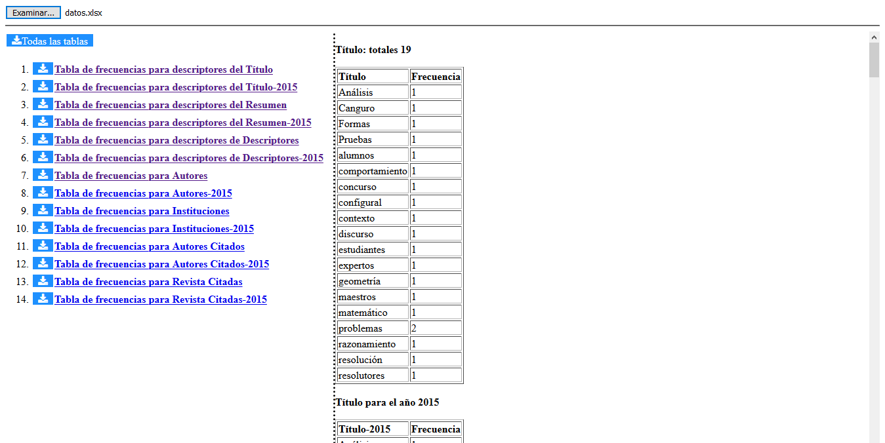

# asjournals

## Utilidad para web análisis de revistas científicas

Es un proyecto NodeJS cuyo objetivo es generar tablas de frecuencias a partir de un fichero de entrada en formato Excel. El fichero de entrada debe cumplir con un formato específico definido para la toma de datos. La herramienta se centra principalmente en el tratamiento de las columnas que contienen datos separados por ';'.

## Características principales

- Tablas de frecuencias totales. 
- Tablas de fecuencias por años.
- Descarga de tablas de frecuencias individual a fichero excel.
- Descarga de todas las tablas a un único fichero excel.

## Requerimientos
Para comenzar a desarrollar sobre el proyecto, necesitará tener Node.js instalado en su entorno. Para **SPA_multi_web** se han utilizado las siguientes versiones: 

    $ node --version
    v12.16.1

    $ npm --version
    6.13.4

## Instalación
Como punto de partida es necesario realizar un clonado del proyecto. Una vez disponible el código fuente, habrá que instalar las dependencias requeridas del proyecto, para lo cual bastará con ejecutar el siguiente comando:

    npm install

## Entorno de desarrollo
Para realizar las pruebas pertinentes del software hay que arrancar el servidor de desarrollo de Node.js, ejecutando la siguiente instrucción:

    npm start

Una vez iniciado el entorno de desarrollo, se podrá acceder al mismo mediante el navegador en la siguiente dirección:

    http://127.0.0.1:9000
    
## Puesta en producción
Si se desea realizar el despliegue, será necesario construir el software mediante el siguiente comando:

    npm run build

Como resultado se creará una carpeta con el nombre **dist** que contiene todos los ficheros necesarios para realizar la puesta en producción.
